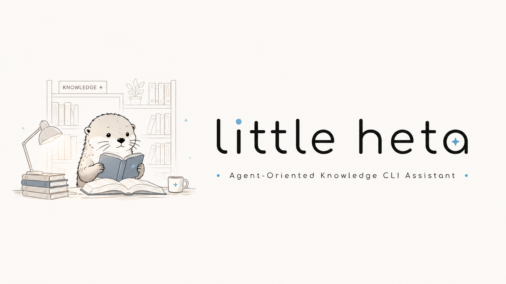

# Little Heta

<p align="center">
  
</p>

<p align="center">
  <a href="README.md">English</a> ·
  <a href="docs/i18n/README.zh-CN.md">简体中文</a> ·
  <a href="docs/i18n/README.zh-TW.md">繁體中文</a> ·
  <a href="docs/i18n/README.ja.md">日本語</a> ·
  <a href="docs/i18n/README.ko.md">한국어</a> ·
  <a href="docs/i18n/README.es.md">Español</a> ·
  <a href="docs/i18n/README.pt.md">Português</a> ·
  <a href="docs/i18n/README.fr.md">Français</a> ·
  <a href="docs/i18n/README.de.md">Deutsch</a>
</p>

<p align="center">
  <a href="https://pypi.org/project/little-heta/"></a>
  <a href="https://pypi.org/project/little-heta/"></a>
  <a href="LICENSE"></a>
  <a href="https://knowledgexlab.github.io/"></a>
</p>

Little Heta is a local CLI knowledge infrastructure for personal documents,
agent memory, and document intelligence. It turns PDFs, Office files, images,
audio, code, HTML, Markdown, and notes into a stable Markdown wiki, adds
semantic vector retrieval, and lets agents reuse distilled knowledge through a
memory layer.

## Install

Install from PyPI:

```bash
pip install little-heta
```

From a local checkout:

```bash
pip install -e .
```

For development:

```bash
pip install -e ".[dev]"
```

The package installs the `heta` command:

```bash
heta --help
```

## Initialize

Run the first-time setup:

```bash
heta init
```

You need to prepare:

- An LLM API key for one provider: Qwen, ChatGPT, or Gemini.
- Optional MinerU access for PDF and Office parsing. Apply or learn more at
  [MinerU](https://mineru.net/).

`heta init` writes config and workspace data under:

```text
~/.heta/
```

It also installs the Little Heta agent skill automatically into:

```text
~/.codex/skills/heta
~/.claude/skills/heta
```

## Use with Codex and Claude Code

After `heta init`, Codex and Claude Code can discover the Little Heta skill
globally. The skill tells the agent when to use:

```bash
heta ask "..."
heta query "..."
heta recall "..."
heta remember "..."
```

You can refresh or reinstall the skill at any time:

```bash
heta skill
```

For other agent frameworks, copy these two files:

```text
~/.heta/skills/heta/SKILL.md
~/.heta/skills/heta/COMMANDS.md
```

## What You Get

Most personal knowledge bases eventually become a `/raw` folder: papers,
slides, screenshots, audio clips, code files, notes, and half-finished drafts
all pile up together. A normal agent can read those files directly, but every
question pays the same cost again: open the index, guess which page matters,
read long pages, and spend tokens rediscovering context it already found before.

Little Heta turns that pile into a persistent agent workspace:

- **Wiki first**: raw files are compiled into stable Markdown pages with
  numeric page ids, clean `[[Wiki Links]]`, and Git history.
- **Vector Wiki**: each page is chunked by Markdown structure, so `heta query`
  can jump to the right section instead of relying only on sparse `index.md`
  summaries.
- **Memory-first retrieval**: `heta ask` stores distilled KB insights after
  expensive lookups, allowing later questions to reuse prior KB understanding
  instead of repeating the same deep wiki traversal.
- **Synchronized memory + KB management**: memory stays tied to the evolving
  wiki. When KB content changes, related memories can be invalidated to prevent
  stale cached insights from drifting away from the source of truth.
- **Agent reuse**: larger teams and multi-agent workflows benefit because useful
  KB discoveries can be reused across later questions, sessions, and agents.

Retrieval quality depends heavily on corpus structure. In corpora where
important details are buried deep inside long wiki pages and poorly represented
by summaries, index-only wiki navigation can suffer severe retrieval collapse.
In our initial stress scenarios, Vector Wiki and memory-backed retrieval
improved answer accuracy by roughly **1.25x-5x+**, with some cases recovering
from **0% to 100%** accuracy.

Memory-backed reuse used **82.1% fewer tokens** than index-only wiki query and
answered **1.14x faster** even in a small-file setting. This gap is expected to
grow in larger or messier workspaces, because index-only wiki navigation scales
with the number and length of pages an agent may need to inspect, while
memory-backed reuse resolves repeated questions from previously distilled
insights. The main extra cost is the first pass that creates the reusable
insight.

## Core CLI

The main commands are:

- `heta init`: set up providers, workspace, and agent skills.
- `heta status`: show provider, MinerU, wiki, memory, and space status.
- `heta insert`: add files or folders to the knowledge base.
- `heta query`: ask a read-only question against inserted documents.
- `heta ask`: answer using memory and the document KB together.
- `heta remember`: save a fact, decision, or preference.
- `heta recall`: retrieve saved memory.
- `heta clean`: remove generated wiki pages and vector DB while keeping raw files.
- `heta vector`: turn document vector indexing on, off, or show status.
- `heta insert-planning`: turn smart insert planning on, off, or show status.
- `heta mem-show`: inspect stored KB memories.
- `heta mem-clean`: erase memory data.
- `heta skill`: install or refresh agent skills.

Detailed command docs:

- [init](docs/cli/init.md)
- [status](docs/cli/status.md)
- [insert](docs/cli/insert.md)
- [query](docs/cli/query.md)
- [ask](docs/cli/ask.md)
- [remember](docs/cli/remember.md)
- [recall](docs/cli/recall.md)
- [clean](docs/cli/clean.md)
- [vector](docs/cli/vector.md)
- [insert-planning](docs/cli/insert-planning.md)
- [mem-show](docs/cli/mem-show.md)
- [mem-clean](docs/cli/mem-clean.md)
- [skill](docs/cli/skill.md)

## Supported Files

Little Heta can insert:

- Markdown and text: `.md`, `.markdown`, `.txt`
- PDF and Office: `.pdf`, `.doc`, `.docx`, `.ppt`, `.pptx`, `.xls`, `.xlsx`
- Images: `.png`, `.jpg`, `.jpeg`, `.webp`, `.gif`, `.bmp`
- Audio and video transcripts: `.mp3`, `.wav`, `.m4a`, `.flac`, `.ogg`, `.mp4`
- Code and config files: `.py`, `.js`, `.ts`, `.tsx`, `.jsx`, `.java`, `.go`,
  `.rs`, `.cpp`, `.c`, `.h`, `.hpp`, `.sh`, `.sql`, `.yaml`, `.yml`, `.json`,
  `.toml`
- HTML: `.html`, `.htm`

PDF and Office parsing require MinerU. Images and audio/video require a
multimodal or transcription-capable LLM provider.

## Workspace

Runtime data lives under:

```text
~/.heta/
```

Important paths:

```text
~/.heta/heta.yaml                  config
~/.heta/workspace/kb/raw           original source files
~/.heta/workspace/kb/wiki          generated Markdown wiki
~/.heta/workspace/kb/db            local vector database
~/.heta/skills/heta                portable Little Heta agent skill
```

## Development

Run tests:

```bash
pytest
```

Project layout:

```text
src/heta/          CLI, config, assistants, memory, and KB implementation
docs/              user and technical documentation
tests/             unit tests
pyproject.toml     package metadata and dependencies
```

## License

Little Heta is released under the MIT License. See [LICENSE](LICENSE).
